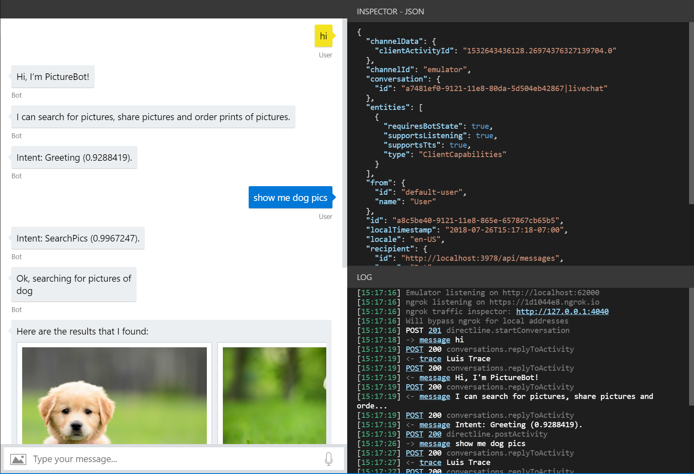

# ラボ 4: チャットをログに記録する

## 紹介

このワークショップでは、Microsoft Bot Framework を使用してログへの記録を実行し、チャットの会話を保存する方法について説明します。このラボを修了すると、次のことができるようになります:

- ボットとユーザーの間のメッセージ アクティビティを取得してログに記録する方法を理解する
- ファイル ストレージに発話のログを記録する

## 前提条件

このラボは、[ラボ 3](../Lab3-Basic_Filter_Bot/02-Basic_Filter_Bot.md)でボットをビルドして公開したという前提で始まります。

このラボで説明するようにログを実装するには、このラボを実行することをお勧めします。そうでない場合、ニーズによっては、すべての演習を注意深く読み、コードの一部を調るか、独自のアプリケーションで使用するだけで十分です。

## ラボ 4.0: メッセージのインターセプトと分析

このラボでは、Bot Framework で、ボットとユーザーの会話からデータをインターセプトしてログに記録できるようにするさまざまな方法について見ていきます。まず、イン メモリ ストレージを利用しますが、これはテスト目的には適していますが、本番環境には適していません。

その後、会話からファイルにデータを書き込む方法の非常に簡単な実装について説明します。具体的には、ユーザーがボットに送信するメッセージを一覧に保存して、一覧と他のいくつかの項目を一時ファイルに保存します (ただし、必要に応じて特定のファイル パスに変更することもできます)。

### Bot Framework Emulator を使用する

ボットに何も追加せずに、テスト目的で収集できる情報を見てみましょう。

1. Visual Studio で **PictureBot.sln** を開きます。

    > **注:** ラボ 3 を実行していない場合は、**Starter** ソリューションを使用できます。

1. **F5** キーを押してボットを再度実行します。

1. Bot Framework Emulator でボットを開き、簡単な会話を行います。

1. Bot Emulator のデバッグ領域を確認し、次の点に注意してください。

  - メッセージをクリックしたら、右側に表示されている 「Inspector-JSON」 ツールを使用すると、関連する JSON を確認できます。メッセージをクリックして JSON を調べ、取得できる情報を確認してください。

  - 右下隅にある「Log」 (ログ) には、会話の完全なログが含まれています。もう少し詳しく見ていきましょう。

    - 最初に表示されるのは、Emulator でリッスンしているポートです。

    - ngrok でリッスンしている場所も確認でき、「ngrok traffic inspector」 リンクを使用して ngrok へのトラフィックを検査することもできます。ただし、ローカル アドレスにヒットする場合は、ngrok をバイパスすることに注意してください。**リモート テストについてはこのワークショップでは取り上げないため、ngrok につていのは情報はここには含まれていません。**

    - 呼び出しでエラーが発生した場合 (POST 200 または POST 201 応答以外)、クリックすると、「Inspector-JSON」 に非常に詳細なログが表示されます。エラーの内容によっては、コードを調べて、エラーが発生した場所を特定することを試みるスタック トレースを取得できることもあります。これは、ボット プロジェクトをデバッグする場合に非常に便利です。

    - また、LUIS を呼び出すときに`Luis Trace`が発生することもわかります。`trace`リンクをクリックすると、LUIS の情報が表示されます。このラボでは、これが設定されていません。

    

    Emulator を使用したテスト、デバッグ、およびログへの記録の詳細については、[ここ](https://docs.microsoft.com/ja-jp/azure/bot-service/bot-service-debug-emulator?view=azure-bot-service-4.0)をお読みください。

## ラボ 4.1: Azure Storage へのログ記録

デフォルトのボット ストレージ プロバイダーでは、ボットの再起動時に破棄されるメモリ内ストレージを使用します。これはテストのみを目的としています。データを保持したいが、ボットをデータベースに接続したくない場合は、Azure Storage プロバイダーを使用するか、SDK を使用して独自のプロバイダーを構築できます。

1. **Startup.cs** ファイルを開きます。  このプロセスはすべてのメッセージに使用するため、Startup クラスで`ConfigureServices`メソッドを使用して、Azure Blob ファイルに格納情報を追加します。現在、以下を使用していることに注意してください。

    ```csharp
    IStorage dataStore = new MemoryStorage();
    ```

    ご覧のとおり、現在の実装ではメモリ内ストレージを使用しています。繰り返しますが、このメモリ ストレージはローカル ボットのデバッグのみに使用することをお勧めします。ボットを再起動すると、メモリに格納されている内容はすべて消えてしまいます。

1. 現在の `IStorage` 行を次の行に置き換えて、FileStorage ベースに変更します。

    ```csharp
    var blobConnectionString = Configuration.GetSection("BlobStorageConnectionString")?.Value;
    var blobContainer = Configuration.GetSection("BlobStorageContainer")?.Value;
    IStorage dataStore = new Microsoft.Bot.Builder.Azure.AzureBlobStorage(blobConnectionString, blobContainer);
    ```

1. Azure Portal を開き、ストレージ アカウントに移動します。

1. **概要**ブレードから、**コンテナー**をクリックします。

1. **chatlog** コンテナが存在しない場合、**chatlog** コンテナを追加します。

1. まだ行っていない場合は、左側のメニューから「**アクセス キー**」をクリックして接続文字列を記録します

1. **appsettings.json** を開き、blob 接続文字列の詳細を追加します。

    ```json
    "BlobStorageConnectionString": "",
    "BlobStorageContainer" :  "chatlog"
    ```

1. **F5** を押してボットを実行します。

1. エミュレーターで、ボットとのサンプル会話を実行します。

    > **注意**: 返信が返されない場合は、お使いの Azure ストレージ アカウントの接続文字列を確認してください。

1. Azure Portal に切り替え、BLOB ストレージ アカウントに移動します。

1. **コンテナ**をクリックして、 **chatlog** コンテナを開きます

1. **emulator...** で始まるチャット ログ ファイルを選択し、「**編集**」 を選択します。

    ファイルには何が表示されていますか? 表示されると思っていたのに、表示されていないのは何ですか?

    次のようなメッセージが表示されます。

    ```json
    {"$type":"System.Collections.Concurrent.ConcurrentDictionary`2[[System.String, System.Private.CoreLib],[System.Object, System.Private.CoreLib]], System.Collections.Concurrent","DialogState":{"$type":"Microsoft.Bot.Builder.Dialogs.DialogState, Microsoft.Bot.Builder.Dialogs","DialogStack":{"$type":"System.Collections.Generic.List`1[[Microsoft.Bot.Builder.Dialogs.DialogInstance, Microsoft.Bot.Builder.Dialogs]], System.Private.CoreLib","$values":[{"$type":"Microsoft.Bot.Builder.Dialogs.DialogInstance, Microsoft.Bot.Builder.Dialogs","Id":"mainDialog","State":{"$type":"System.Collections.Generic.Dictionary`2[[System.String, System.Private.CoreLib],[System.Object, System.Private.CoreLib]], System.Private.CoreLib","options":null,"values":{"$type":"System.Collections.Generic.Dictionary`2[[System.String, System.Private.CoreLib],[System.Object, System.Private.CoreLib]], System.Private.CoreLib"},"instanceId":"f80db88d-cdea-4b47-a3f6-a5bfa26ed60b","stepIndex":0}}]}},"PictureBotAccessors.PictureState":{"$type":"Microsoft.PictureBot.PictureState, PictureBot","Greeted":"greeted","Search":"","Searching":"no"}}
    ```

## ラボ 4.2: ファイルに発話のログを記録する

このラボでは、ユーザーがボットに送信する実際の発話を追加します。これは、ユーザーがボットを使用して完了しようとしている会話やアクションの種類を決定するのに役立ちます。

これを行うには、**PictureState.cs** ファイル内の`UserData`オブジェクトに格納されている内容を更新して、**PictureBot.cs** 内のオブジェクトに情報を追加します。

1. **PictureState.cs** を開く

1. 次のコードの**後**に

    ```csharp
    public class PictureState
    {
        public string Greeted { get; set; } = "not greeted";
    ```

    以下を追加します。

    ```csharp
    // ユーザーがボットに話した内容の一覧
    public List<string> UtteranceList { get; private set; } = new List<string>();
    ```

    上記では、ユーザーがボットに送信するメッセージを格納する一覧を簡単に作成できます。

    この例では、状態マネージャーを使用してデータの読み取りと書き込みを行うことを選択していますが、[状態マネージャを使用せずにストレージから直接読み取りおよび書き込みを行う](https://docs.microsoft.com/ja-jp/azure/bot-service/bot-builder-howto-v4-storage?view=azure-bot-service-4.0&tabs=csharpechorproperty%2Ccsetagoverwrite%2Ccsetag)ことができます。

    > ストレージに直接書き込むことを選択した場合は、シナリオに応じて、eTags を設定できます。eTag プロパティを`*`に設定すると、ボットの他のインスタンスによって以前に書き込まれたデータを上書きできるようになります。ここでは詳しく説明しませんが、[同時管理の詳細については、ここを参照してください](https://docs.microsoft.com/ja-jp/azure/bot-service/bot-builder-howto-v4-storage?view=azure-bot-service-4.0&tabs=csharpechorproperty%2Ccsetagoverwrite%2Ccsetag#manage-concurrency-using-etags)。

    ボットを実行する前に最後に行う必要があるのは、`OnTurn`アクションを使用してメッセージを一覧に追加することです。

1. **PictureState.cs** の先頭に、以下のusingディレクティブを追加します。
    ```
    using System.Collections.Generic;
    ```

1. **Bots/PictureBot.cs** を開き、次のコードの**後**に

    ```csharp
    public override async Task OnTurnAsync(ITurnContext turnContext, CancellationToken cancellationToken = default(CancellationToken))
            {
                if (turnContext.Activity.Type is "message")
                {
    ```

    以下を追加します。

    ```csharp
    var utterance = turnContext.Activity.Text;
    var state = await _accessors.PictureState.GetAsync(turnContext, () => new PictureState());
    state.UtteranceList.Add(utterance);
    await _accessors.ConversationState.SaveChangesAsync(turnContext);
    ```

    > **注**: 状態を変更する場合は、状態を保存する必要があります

    最初の行は、ユーザーからの受信メッセージを受け取り、`utterance`と呼ばれる変数に格納します。次の行では、PictureState.cs で作成した既存の一覧に発話を追加します。

1. **F5** を押してボットを実行します。

1. ボットと別の会話をします。ボットを停止し、最新の BLOB のログ ファイルを確認します。今度は何が表示されていますか?

    ```json
    {"$type":"System.Collections.Concurrent.ConcurrentDictionary`2[[System.String, System.Private.CoreLib],[System.Object, System.Private.CoreLib]], System.Collections.Concurrent","DialogState":{"$type":"Microsoft.Bot.Builder.Dialogs.DialogState, Microsoft.Bot.Builder.Dialogs","DialogStack":{"$type":"System.Collections.Generic.List`1[[Microsoft.Bot.Builder.Dialogs.DialogInstance, Microsoft.Bot.Builder.Dialogs]], System.Private.CoreLib","$values":[{"$type":"Microsoft.Bot.Builder.Dialogs.DialogInstance, Microsoft.Bot.Builder.Dialogs","Id":"mainDialog","State":{"$type":"System.Collections.Generic.Dictionary`2[[System.String, System.Private.CoreLib],[System.Object, System.Private.CoreLib]], System.Private.CoreLib","options":null,"values":{"$type":"System.Collections.Generic.Dictionary`2[[System.String, System.Private.CoreLib],[System.Object, System.Private.CoreLib]], System.Private.CoreLib"},"instanceId":"f80db88d-cdea-4b47-a3f6-a5bfa26ed60b","stepIndex":0}}]}},"PictureBotAccessors.PictureState":{"$type":"Microsoft.PictureBot.PictureState, PictureBot","Greeted":"greeted","UtteranceList":{"$type":"System.Collections.Generic.List`1[[System.String, System.Private.CoreLib]], System.Private.CoreLib","$values":["help"]},"Search":"","Searching":"no"}}
    ```

    > 行き詰まってしまったときは? このラボのこの時点までのソリューションは、[Lab04-Log_Chat/code/Finished](./code/Finished/) にあります。`appsettings.json` ファイルに Azure Bot Service と Azure Storage の設定のキーを挿入する必要があります。このコードは、ソリューションとして実行するのではなく、参照として使用することをお勧めしますが、実行する場合は、必要なキーを必ず追加してください。

## さらに進む

データベース ストレージとテストをログ ソリューションに組み込むには、このソリューションに基づいて構築される次の自習方式のチュートリアルをお勧めします。[Cosmosにデータを保存する](https://github.com/Azure/LearnAI-Bootcamp/blob/master/lab02.5-logging_chat_conversations/3_Cosmos.md)。

## 次のステップ

- [ラボ 05-01: QnA Maker](../Lab5-QnA/01-Introduction.md)