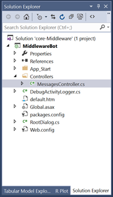

# アクティビティ ロガー

## 1. 目的

このラボは、Microsoft Bot Framework を使用したログ記録の開始を目的としています。具体的には、このラボでは、アクティビティ ロガーを使用して会話をログに記録する方法を示します。このラボでのログ記録は、デバッグを使用して実行されます。

## 2. セットアップ

Visual Studio の code\core-Middleware から core-Middleware コードをインポートします。これを実行する最も簡単な方法は、core-Middleware.sln を開くことです。ソリューション エクスプローラーは、Visual Studio で次のように表示されます。



## 3. IActivityLogger

会話の履歴を処理するとき、最も一般的な操作の 1 つは、ボットとユーザーの間のメッセージ アクティビティをインターセプトしてログに記録することです。「IActivityLogger」インターフェイスには、クラスでメッセージ アクティビティをログに記録するために実装する必要がある機能の定義が含まれています。デバッグで実行しているときにのみトレース リスナーにメッセージ アクティビティを書き込む「IActivityLogger」インターフェイスの「DebugActivityLogger」の実装。

````C#
public class DebugActivityLogger : IActivityLogger
{
    public async Task LogAsync(IActivity activity)
    {
        Debug.WriteLine($"From:{activity.From.Id} - To:{activity.Recipient.Id} - Message:{activity.AsMessageActivity().Text}");
    }
}
````
ログ アクティビティは、ボット アプリケーションの有効期間内に発生するイベントです。Application_Start メソッドはアプリケーションの起動時に呼び出され、アプリケーションの有効期間中に存続します。

Global.asax を使用すると、重要なライフサイクル イベントに対応するイベント ハンドラーを記述できます。Global.asax イベントは、ユーザーが直接呼び出すことはありません。これらは、アプリケーション イベントに反応して自動的に呼び出されます。このラボでは、次のように Application_Start (Global.asax 内) に DebugActivityLogger を登録する必要があります。

````C#
protected void Application_Start()
{
    Conversation.UpdateContainer(builder =>
    {
        builder.RegisterType<DebugActivityLogger>().AsImplementedInterfaces().InstancePerDependency();
    });
    GlobalConfiguration.Configure(WebApiConfig.Register);
}
````

Application_Start メソッドは、アプリケーションのライフサイクル中に 1 回だけ呼び出されます。このメソッドを使用して、スタートアップ タスクを実行できます。

## 4. 結果をログに記録する

ボット アプリケーションを実行し、メッセージを使用してエミュレーターでテストします。ログ データは Debug.WriteLine を使用して書き込まれます。出力ウィンドウを使用して結果を表示できます。*「出力元の表示」* で "Debug" (デバッグ) が選択されていることを確認します。 出力が表示されない場合は、メニューから 「表示」 > 「出力」を選択します。````From:56800324 - To:2c1c7fa3 - Message:hello````のようなエントリが表示されます。これはエコー ボットであるため、もログに記録されたエコー メッセージも表示されます。


### [2_File_Logger](2_File_Logger.md) に進みましょう

[0_README](../0_README.md) に戻る