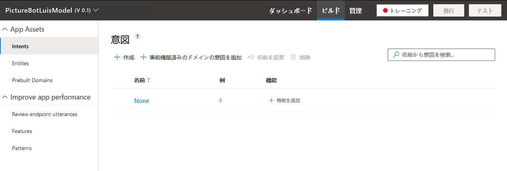
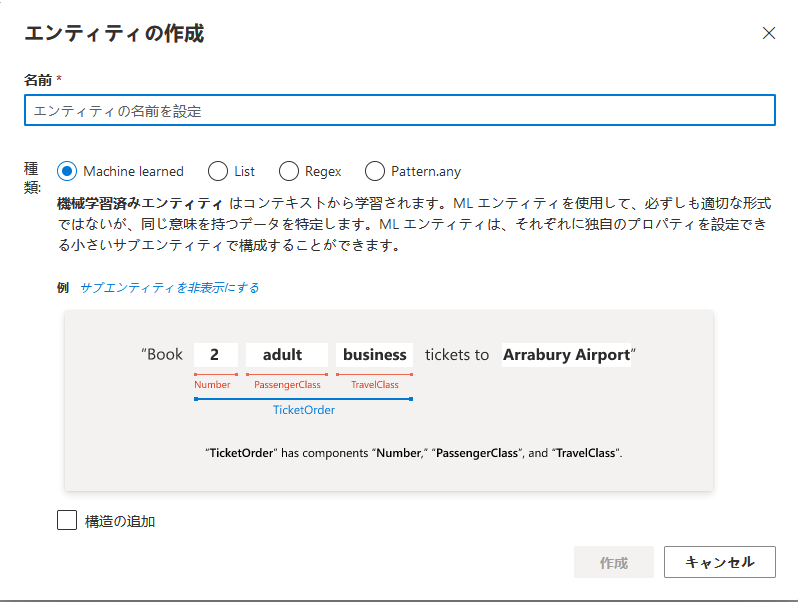

# 課題 6: LUIS モデルの実装

このハンズオン ラボでは、マイクロソフトの Language Understanding Intelligent Service (LUIS) を使用して、アプリケーションの自然言語処理機能を強化したモデルを作成する方法について説明します。

## 紹介

このラボでは、LUIS モデルの構築、トレーニング、および公開を行い、(将来のラボで作成される) ボットが人間のユーザーと効果的に通信できるようにします。

> **注記:** このラボでは、今後のラボで使用する LUIS モデルのみを作成して、よりインテリジェントなボットを構築します。

LUIS の機能については既にワークショップで説明しました。LUIS について復習するには、[詳細をお読みください](https://docs.microsoft.com/ja-jp/azure/cognitive-services/LUIS/Home)。

LUIS の概要を把握したところで、LUIS アプリを計画します。既に特定のテキストが含まれるメッセージに応答する基本的なボット ("PictureBot") を作成しています。ボットが実行できるさまざまなアクションをトリガーする意図を作成し、さまざまなアクションに必要なエンティティを作成する必要があります。たとえば、PictureBot の意図は "OrderPic" であり、適切な応答を提供するためにボットをトリガーするとします。

たとえば、「Search」の場合 (ここでは実装されません)、PictureBot の意図が "SearchPics" であり、写真を検索するために Azure Cognitive Search サービスがトリガーされます。これには、検索対象を知るために "facet" エンティティが必要です。  アプリを計画するためのその他の例については、[ここ](https://docs.microsoft.com/ja-jp/azure/cognitive-services/LUIS/plan-your-app)を参照してください。

アプリについて考え抜いたら、[それを構築してトレーニングする](https://docs.microsoft.com/ja-jp/azure/cognitive-services/LUIS/luis-get-started-create-app)準備が整いました。

復習のために、LUIS アプリケーションの作成時に一般的に実行する手順は次のとおりです。

  1. [意図を追加する](https://docs.microsoft.com/ja-jp/azure/cognitive-services/LUIS/add-intents)
  2. [発話を追加する](https://docs.microsoft.com/ja-jp/azure/cognitive-services/LUIS/add-example-utterances)
  3. [エンティティを追加する](https://docs.microsoft.com/ja-jp/azure/cognitive-services/LUIS/add-entities)
  4. [フレーズ リスト](https://docs.microsoft.com/ja-jp/azure/cognitive-services/LUIS/add-features)と[パターンを使用してパフォーマンスを向上させる](https://docs.microsoft.com/ja-jp/azure/cognitive-services/LUIS/luis-how-to-model-intent-pattern)
  5. [トレーニングとテストを行う](https://docs.microsoft.com/ja-jp/azure/cognitive-services/LUIS/train-test)
  6. [エンドポイントの発話を確認する](https://docs.microsoft.com/ja-jp/azure/cognitive-services/LUIS/label-suggested-utterances)
  7. [公開する](https://docs.microsoft.com/ja-jp/azure/cognitive-services/LUIS/publishapp)

## ラボ 6.0: Portal での LUIS サービスの作成 (オプション)

LUIS ではラボで使用できる "スターター キー" が提供されるため、Portal での LUIS サービスの作成はオプションです。ただし、Portal で無料または有料のサービスを作成する方法を確認する場合は、以下の手順に従って実行できます。  

> **注**;  pre-req ARMテンプレートを実行した場合、Language Understanding API を含む Cognitive Services リソースがすでにあります。

1. [Azure Portal](https://portal.azure.com) を開く

1. 「**+ リソースの作成**」を選択します。

1. 検索ボックスに**言語理解**を入力して、 **言語理解**を選びます

1. 「**作成**」を選択します

1. 名前に **{YOURINIT} luisbot** と入力します

1. リソースグループに似たサブスクリプションと場所を選択します。

1. 価格帯については、 **F0**を選択します

1. リソース グループを選択します。

1. ランタイムの場所については、リソース グループに類似した場所を選択します。

1. ランタイムの価格は、**F0** を選択します。

1. 「**作成**」を選択します

**注:** Luis AI Web サイトでは、Azure ベースのコグニティブ サービス リソースを制御または公開することはできません。  トレーニングと公開を行うには、API を呼び出す必要があります。

## ラボ 6.1: LUIS を使用してアプリケーションにインテリジェンスを追加する

LUIS を使用して、自然言語機能を追加する方法を見てみましょう。LUIS を使用すると、自然言語の発話 (ボットと話すときにユーザーが話す単語/フレーズ/文) を意図 (ユーザーが実行するタスクやアクション) にマッピングできます。ここでは、写真の検索、写真の共有、写真のプリントの順序付けなど、いくつかの意図があります。これらの事柄を尋ねる方法として、発話のいくつかの例をご紹介します。LUIS では、学習した内容に基づいて、それぞれの意図に追加の新しい発話がマッピングされます。

> **警告**: Azure サービスでは IE を既定のブラウザーとして使用しますが、LUIS にはお勧めしません。すべてのラボで Chrome または Firefox を使用できるはずです。あるいは、[Microsoft Edge](https://www.microsoft.com/ja-jp/download/details.aspx?id=48126) または [Google Chrome](https://www.google.com/intl/en/chrome/) のいずれかをダウンロードすることもできます.

1. [https://www.luis.ai](https://www.luis.ai)に移動します （**ヨーロッパまたはオーストラリアにいない場合***）。ボットをサポートする新しい LUIS アプリを作成します。

> 注: **ヨーロッパ** リージョンでキーを作成した場合は、[https://eu.luis.ai/](https://eu.luis.ai/) でアプリケーションを作成する必要があります。***オーストラリア** リージョンでキーを作成した場合は、[https://au.luis.ai/](https://au.luis.ai/) でアプリケーションを作成する必要があります。LUIS を公開しているリージョンの詳細については、[ここ](https://docs.microsoft.com/ja-jp/azure/cognitive-services/luis/luis-reference-regions)を参照してください。

1. 組織のアカウントまたは Microsoft アカウントを使用してサインインします。(これは、前のセクションで LUIS キーを作成したのと同じアカウントにする必要があります)。

1. 「**今すぐ LUIS アプリを作成する**」をクリックします。LUIS アプリケーションの一覧にリダイレクトされるはずです。  メッセージが表示されたら、「**後で移行する**」をクリックします。  

1. 初めての場合は、サービスの利用規約に同意し、お住まいの国を選択するよう求められます。

- 次のステップでは、推奨オプションを選択し、Azure アカウントを LUIS にリンクする必要があります。
- 最後に設定を確認すると、LUIS アプリページに転送されます。

> **注意**: [現在のページ](https://www.luis.ai/applications)の「New App」 (新しいアプリ) ボタンの横に「Import App」 (アプリのインポート) もあります。  LUIS アプリケーションを作成した後、アプリ全体を JSON としてエクスポートし、ソース管理にチェックインできます。  これは推奨されるベスト プラクティスであり、コードのバージョン管理に合わせて LUIS モデルのバージョンを管理できます。  エクスポートされた LUIS アプリは、「Import App」 (アプリのインポート) ボタンを使用して再インポートできます。  ラボの進行が遅れてしまい、ショートカットする場合は、「Import App」 (アプリのインポート) ボタンをクリックして [LUIS モデル](./code/LUIS/PictureBotLuisModel.json)をインポートできます。

1. メイン ページで、「**新しいアプリの作成**」ボタンをクリックします

1. 名前を入力し、「**完了**」をクリックします。  「効果的な LUIS アプリの作成方法」 ダイアログを閉じます。

1. 上部のナビゲーションで、「**ビルド**」 リンクを選択します。  "None" (なし) という意図が 1 つあることにも注意してください。  いずれの意図にもマッピングされないランダムな発話は、"None" (なし) にマッピングされる場合があります。

ボットが次のことを実行できるようにしましょう。

- 写真を検索する
- ソーシャル メディアで写真を共有する
- 写真のプリントを注文する
- ユーザーに挨拶する (ただし、これは後で説明するように、他の方法でも可能)

これらのそれぞれを要求するユーザーの意図を作成してみましょう。  

1. 「**新しい意図の作成**」ボタンをクリックします。

1. 最初の意図に「**Greeting**」という名前を付け、「**完了**」をクリックします。  

1. ボットに挨拶するときにユーザーが話す可能性のある言葉の例をいくつか示し、それぞれの後に Enter キーを押します。

エンティティを作成する方法を見てみましょう。  ユーザーが写真の検索を要求するとき、何を探すかを指定できます。 エンティティ内でキャプチャしてみましょう。

1. 左側の列内の「**エンティティ**」を選択してから「**+ 作成**」を選択します。  

1. エンティティ名 **facet** を付ける

1. エンティティ タイプとして「**機械学習済み**」を選択します。  

1. 「**作成**」を選択します。

1. 左側のサイドバーの「**意図**」をクリックし、「**新しい意図の作成**」ボタンをクリックします。  

1. 「**SearchPics**」という意図名を付け、「**完了**」をクリックします。

"greetings" で行ったのと同じように、いくつかのサンプル発話 (ボットと話すときにユーザーが話す可能性のある単語/フレーズ/文) を追加してみましょう。  写真を検索する方法は数多くあります。  以下の発話の一部を自由に使用して、ボットに写真を検索するように依頼する方法について独自の文章を追加してください。

- Find outdoor pics (屋外の写真を見つける)
- Are there pictures of a train? (電車の写真はあるか)
- Find pictures of food. (食べ物の写真を見つける)
- 遊んでいる子供の写真を検索する
- Show me beach pics (ビーチの写真を見せて)
- 犬の写真を見つける
- Show me pictures of men wearing glasses (眼鏡をかけている男性の写真を見せて)
- Show me happy baby pics (幸せな赤ちゃんの写真を見せて)

いくつかの発話を用意したら、**検索トピック**を "facet" エンティティとして選択する方法を LUIS に教える必要があります。"facet" エンティティが選択するものは何でも検索されます。

1. 単語にカーソルを合わせてクリックするか、連続する単語をクリックして単語のグループを選択し、次に "facet" エンティティを選択します。

ファセットにラベルが付けられると、発話がこのようになる可能性があります。

>**注**: このワークショップには Azure Cognitive Search は含まれていませんが、この機能はデモンストレーションのために残されています。

1. 左側のサイドバーの「**意図**」をクリックして、さらに 2 つの意図を追加します。

- 1つの意図に「**SharePic**」という名前を付けます。  これは、次のような発話によって識別される場合があります。

  - この写真を共有
  - ツイートできますか?
  - ツイッターに投稿

- 「**OrderPic**」という名前の別の意図を作成します。  これは、次のような発話で伝達できます。

  - この写真を印刷
  - プリントを注文したい
  - 8x10 が入手可能であるか
  - 注文ウォレット

発話を選択するときには、質問、命令、"...したい..." 形式の組み合わせを使用すると便利です。

1. 最後に、"None" という意図にサンプル発話を追加する必要があります。これにより、アプリケーションのスコープ外である場合に LUIS にラベルを付けることができます。"I'm hungry for pizza" (ピザを食べたい)、"Search videos" (動画を検索) などを追加します。「None」 (なし) という意図には、アプリの発話の約 10-15% が必要です。

## ラボ 6.2: LUIS モデルのトレーニング

これで、モデルをトレーニングする準備が整いました。この練習では、モデルをテストするために簡単なトレーニング操作を実行します。  テストは、LUIS ポータルの組み込みテスト パネルを使用して行われます。

1. 一番上のメニューで、「**トレーニング**」を選択します。トレーニング中、LUIS はモデルを構築し、提供されたトレーニング データに基づいて発話をマッピングします。

    > [!TIP]
    > トレーニングはすぐに行われるとは限りません。場合によっては、キューに入れられ、数分かかることがあります。

## LUIS サービスのパブリック エンドポイントを作成する

1. トレーニングが終了したら、上部のツールバーにある「**管理**」を選択します。左側のツールバーに次のオプションが表示されます。

    > 注意:
    > ポータルが更新されると、左側のウィンドウのカテゴリが変更される場合があります。  その結果、キーとエンドポイントは、ここに示されているものとは異なるカテゴリに分類される可能性があります。

    - **設定を公開する**
    - **Azure リソース**
    - **バージョン**
    - **コラボレーション**

1. 「**Azure リソース**」を選択します。この画面は、LUIS サービスへのアクセスに使用される URL エンドポイントを管理するために使用されます。

    > 注意:
    > **Starter_Key** という名前のエンドポイントはテスト目的で自動的に作成され、ここで使用することができます。ただし、運用環境またはアプリケーション内でサービスを使用する場合は、Azure で作成された実際の Language Understanding リソースに常に結び付けることをお勧めします。

1. 「**予測リソース**」と「**Starter_Key**」リソースが既に作成されていることがわかります。  **予測リソース**が表示されている場合は、「**アプリを公開する**」の次のセクションに進みます。
1. 既存の**予測リソース**が表示されない場合は、「**予測リソースの追加**」を選択します。「**テナント**」は既に選択されています。
1. サブスクリプションと、先に Azure Portal で作成したリソースを選択し、「**完了**」を選択してから Language Understanding リソースを LUIS サービスに接続します。

## アプリを公開する

1. トップバーで「**公開**」をクリックします。

   > 注意:
   > **運用** エンドポイントまたは **ステージング** エンドポイントに発行できます。「**Production**」 (運用) を選択し、2 つのエンドポイントの理由について確認してください。

1. 「**発行スロットと設定を選択する**」で、「**運用スロット**」を選択してから「**完了**」を選択します。

    公開すると、LUIS モデルを呼び出すエンドポイントが作成されます。エンドポイント URL が表示されます。エンドポイント URL をコピーし、今後使用するためにキーのリストに追加します。

1. トップバーで「**テスト**」をクリックします。発話を入力して、意図が返されることを確認してください。これらのタスクの例を次に示します。

   | 発話 | 結果 | スコアの意味 |
   |---------|---------|---------|
   | **地元のビーチの写真を表示して** | スコア付きの **SearchPic** 意図が返されます。 | 高い一致 |
   | **Hello** | スコア付きの **Greeting** 意図が返されます。 | ほぼ正しい一致 |
   | **トムに送信する** | 低いスコアで**ユーティリティ**が返されます | 再トレーニングが必要か、意図に一致しません |

低スコアの発話のモデルを再トレーニングするには、次の手順を実行します。

1. 低スコアの発話 (この場合は「**トムに送信する**」) の横にある「**検査**」を選択します。
1. 「**上位のスコアの意図**」の横にあるドロップダウンを選択し、リストから「**SharePic**」を選択します。
1. 「**テスト**」パネルを閉じます。
1. 「**トレーニング**」ボタンを選択して、モデルを再トレーニングします。
1. **トムに送信する**の発話を再度テストします。高いスコアで **SharePic**意図が返されるようになります。

これで、クライアント アプリケーションで LUIS アプリを使用したり、一覧に記載されたエンドポイントを介してブラウザーでテストしたり、ボットに統合したりする準備が整いました。

[公開されたエンドポイントをブラウザーでテストする](https://docs.microsoft.com/ja-jp/azure/cognitive-services/LUIS/PublishApp#test-your-published-endpoint-in-a-browser)こともできます。エンドポイントの URL をコピーします。ブラウザーでこの URL を開くには、URL パラメーター`&q`をテスト クエリに設定します。たとえば、URL に`Find pictures of dogs`を追加し、Enter キーを押します。ブラウザーには、HTTP エンドポイントの JSON 応答が表示されます。

## さらに進む

まだ時間がある場合は、www.luis.ai サイトを探索してください。「Prebuilt Domains」 (事前構築済みドメイン) を選択し、[既に利用できるものを確認してください](https://docs.microsoft.com/ja-jp/azure/cognitive-services/luis/luis-reference-prebuilt-domains)。また、[他の機能](https://docs.microsoft.com/ja-jp/azure/cognitive-services/luis/luis-concept-feature)や[パターン](https://docs.microsoft.com/ja-jp/azure/cognitive-services/luis/luis-concept-patterns)の一部を確認し、
LUIS モデルの作成、LUIS モデルの管理、会話のシミュレーションなどを行うための [BotBuilder](https://github.com/Microsoft/botbuilder-tools) ツールを確認することもできます。後で、[LUIS スキーマの設計方法が含まれる別のコース](https://aka.ms/daaia)に興味を抱くこともあるでしょう。

## 追加クレジット

Azure Cognitive Search が含まれる LUIS モデルの作成を試みる場合は、[検索を含めた LUIS モデル](https://github.com/Azure/LearnAI-Bootcamp/tree/master/lab01.5-luis)のトレーニングに従います。

## 次のステップ

- [ラボ 07-01: 統合 LUIS](../Lab7-Integrate_LUIS/01-Introduction.md)
