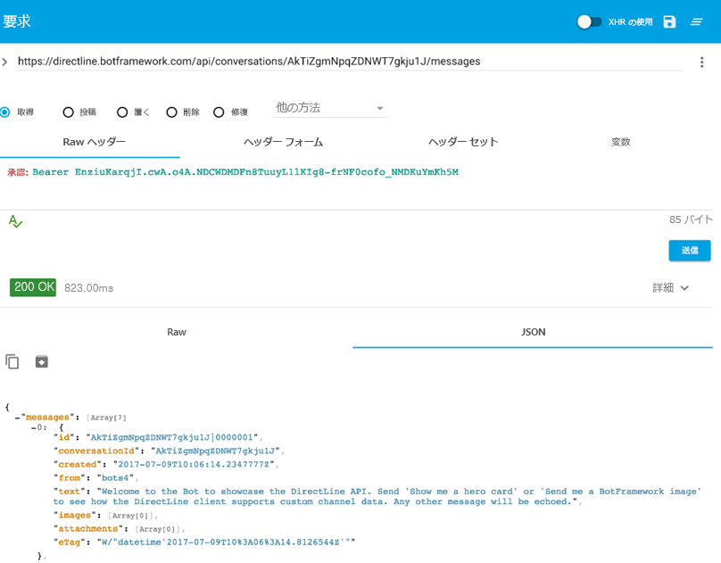

# ボットに直接接続する - Direct Line

## 目的

状況によっては、ボットと直接通信する必要があります。たとえば、ホストされたボットを使用して機能テストを実行する場合です。ボットと独自のクライアント アプリケーション間の通信は、[Direct Line API](https://docs.microsoft.com/ja-jp/bot-framework/rest-api/bot-framework-rest-direct-line-3-0-concepts) を使用して実行できます。このハンズオン ラボでは、Direct Line API に関連する主要な概念を紹介します。

## セットアップ

1. code\core-DirectLine からプロジェクトを開き、Visual Studioでソリューションをインポートします。

2. DirectLineBot ソリューションには、次の 2 つのプロジェクトがあります。DirectLineBot と DirectLineSampleClient。**(以前のラボで) 公開されたボット** を使用するか、このラボで **DirectLineBot** を公開するかを選択できます。

DirectLineBot を使用するには、次の操作を行う必要があります。

- Azure にデプロイします。[このチュートリアル](https://docs.microsoft.com/ja-jp/bot-framework/deploy-dotnet-bot-visual-studio)に従って、Visual Studio から Azure に .NET ボットを直接デプロイする方法について説明します。

- 他のユーザーが DirectLineBot を使用できるようにするには、事前に portal に登録します。登録する手順は、[登録手順](https://docs.microsoft.com/ja-jp/bot-framework/portal-register-bot)に記載されています。


DirectLineSampleClient は、ボットにメッセージを送信するクライアントです。

## 認証

Direct Line API 要求は、Azure Portal の Direct Line チャネル構成ページから取得した秘密を使用して認証できます。Azure portal に移動し、ボットを見つけます。「Bot Management」 (ボット管理) で **「Channels」** (チャネル) を選択して Direct Lineを追加し、「Direct Line」を選択します。「Show」 (表示) を選択して鍵をコピーすると、Direct Line チャネル構成ページから秘密鍵を取得できます。


**セキュリティ スコープ**

秘密鍵: 秘密鍵はアプリケーション全体が対象となり、クライアント アプリケーションに埋め込まれます。アプリケーションによって開始されるすべての会話で同じ秘密を使用します。これは非常に便利です。

トークン: トークンは会話に固有です。その秘密を使用してトークンを要求し、そのトークンとの会話を開始できます。発行時から 30 分間有効ですが、更新できます。

## Web 構成

Azure Portal の *「Configure Direct Line」* (Direct Line の構成) から取得した秘密鍵を、公開されたボットの Web.config ファイルの構成設定に追加する必要があります。さらに、ボット ID (ボット ハンドルとも呼ばれる)、アプリ パスワード、およびアプリ ID をキャプチャして追加し、DirectLineSampleClient プロジェクトから App.config の app.settings 部分に入力する必要があります。App.config に入力/編集する Web.config の関連行は、次のように一覧表示されます。

```csharp
<add key="DirectLineSecret" value="YourBotDirectLineSecret" />
<add key="BotId" value="YourBotId/" />
<add key="MicrosoftAppId" value="YourAppId" />
<add key="MicrosoftAppPassword" value="YourAppPassword" />
```

## メッセージの送受信

Direct Line API を使用すると、クライアントが HTTP Post 要求を発行してボットにメッセージを送信できます。クライアントは WebSocket ストリームを介して、または HTTP GET 要求を発行することによって、ボットからメッセージを受信できます。このラボでは、メッセージを受信するための HTTP Get オプションについて説明します。

1.	構成の変更を行った後、プロジェクト DirectLineSampleClient を実行します。

2.	コンソール経由でメッセージを送信し、会話 ID を取得します。Program.cs の 52 行目では、ボットと対話するために必要な会話 ID を出力します。

	````Console.WriteLine("Conversation ID:"+ conversation.ConversationId);````

	

3.	会話 ID を取得すると、HTTP Get を使用してユーザーとボットのメッセージを取得できるようになります。特定の会話のメッセージを取得するには、GET 要求を https://directline.botframework.com/api/conversations/{conversationId}/messages エンドポイントに対して発行します。また、生のヘッダーの一部として秘密鍵を渡す必要があります (つまり、Authorization: Bearer {secretKey})。

4.	任意の Rest クライアントを使用して、HTTP Get を介してメッセージを受信できます。このラボでは、cURL または Web ベースのクライアントを利用します。

	4.1 cURL:

	cURL は、さまざまなプロトコルを使用してデータを転送するためのコマンド ライン ツールです。cURL は 	
	Https://curl.haxx.se/download.html からダウンロードできます。

	端末を開き、cURL がインストールされている場所に移動し、特定の会話に対して以下のコマンドを実行します。
		
	```
	curl -H "Authorization:Bearer {SecretKey}" https://directline.botframework.com/api/conversations/{conversationId}/messages -XGET
	```

	


	4.2 Web ベースの Rest クライアント:

	Chrome で[高度な Rest クライアント](https://advancedrestclient.com/)を使用して、ボットからメッセージを受信できます。 
	
	高度な Rest クライアントを使用するには、ヘッダーにヘッダー名 (Authorization) とヘッダー値 (Bearer SecretKey) が含まれている必要があります。要求の URL は https://directline.botframework.com/api/conversations/{conversationId}/messages エンドポイントになります。
	
	次の図は、*高度な Rest クライアント* から取得した会話を示しています。会話 "Hi there" と、エコー バックされる対応するボット応答に注意してください。

	

	&nbsp;

	

5.	Direct Line API 3.0

	3.0 では、以前のバージョンとは異なり、イメージやヒーロー カードなどのリッチ メディアを送信することもできます。DirectLineBotDialog.cs を使用している場合、ケース ステートメントの 1 つは、イメージを送信するテキスト "send me a botframework image" (ボットフレームワーク画像を送信) というテキストを検索します。

	```c#
	case "send me a botframework image":
						
		reply.Text = $"Sample message with an Image attachment";

			var imageAttachment = new Attachment()
			{
			ContentType = "image/png",
					ContentUrl = "https://docs.microsoft.com/ja-jp/bot-framework/media/how-it-works/architecture-resize.png",
			};

		reply.Attachments.Add(imageAttachment);
	```

	クライアントを使用してこのテキストを入力し、以下に示すように cURL を使用して結果を表示します。イメージ配列に表示されるイメージ URL が表示されます。

	

	
 ### [README](../0_README.md) に進み、ラボを復習してください